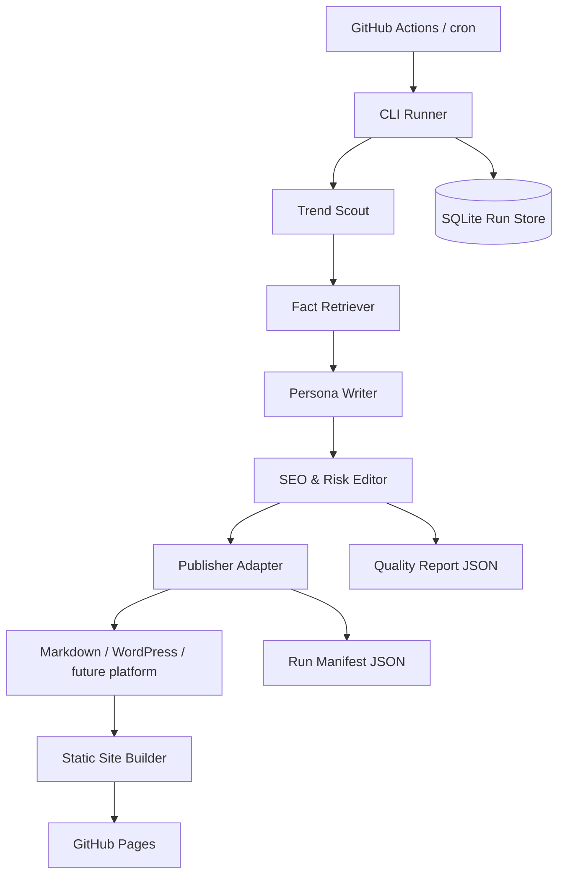

# Architecture

## Workflow

1. `TrendScout` selects daily topics from RSS sources and evergreen Korean search keywords.
2. `FactRetriever` attaches reliable source hints when a topic has no source yet.
3. `WriterAgent` writes with OpenAI when `OPENAI_API_KEY` exists, otherwise uses a deterministic fallback template.
4. `SeoEditorAgent` checks keyword repetition, body length, table presence, AI-like phrases, and false first-person local review claims.
5. `Publisher` saves Markdown drafts or publishes to WordPress.
6. `RunStore` records every run in SQLite and writes a JSON manifest.
7. `ReportWriter` stores a quality report for later review.
8. `StaticSiteBuilder` renders Markdown drafts into `public/` for GitHub Pages hosting.

## Why This Shape

- The source layer is conservative because unstable scraping breaks daily automation quickly.
- The writer layer is replaceable, so model and prompt experiments do not touch publishing logic.
- The publisher layer is isolated because Naver, Tistory, WordPress, and static-site flows have different operational risks.
- Run history is stored locally so GitHub Actions failures can be diagnosed after the fact.

## Extension Points

- Add a Tistory adapter in `blog_agent/publishers.py`.
- Add safer official APIs or paid search APIs in `blog_agent/trends.py`.
- Add image generation or public image APIs before publishing.
- Add a human-review queue by saving drafts with `status: draft` instead of immediate publish.
