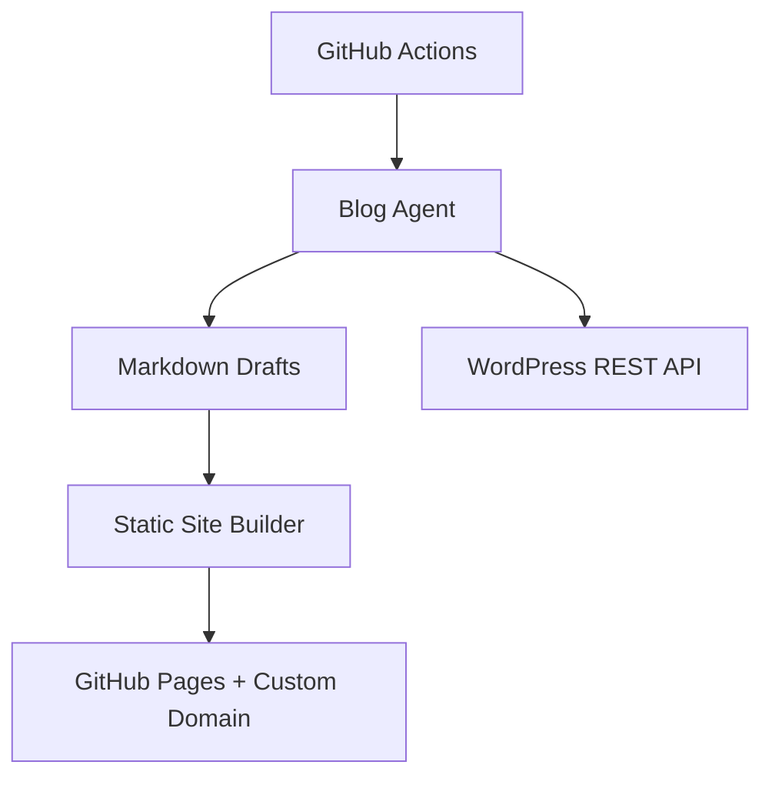

# Hybrid GitHub Pages + WordPress Publishing

이 구성은 같은 글을 두 곳에 동시에 보냅니다.

- GitHub Pages: 개인 도메인을 붙일 공개 블로그
- WordPress: REST API로 자동 포스팅되는 CMS/검수/백업 채널

## Architecture



## Required GitHub Secrets

`Settings → Secrets and variables → Actions → Secrets`

- `OPENAI_API_KEY`
- `WORDPRESS_URL`
- `WORDPRESS_USERNAME`
- `WORDPRESS_APP_PASSWORD`

## Recommended GitHub Variables

`Settings → Secrets and variables → Actions → Variables`

- `BLOG_SITE_TITLE`: 사이트명
- `BLOG_CUSTOM_DOMAIN`: 예: `example.com`
- `WORDPRESS_STATUS`: `publish` 추천. 임시 저장이 필요할 때만 `draft`
- `HYBRID_POST_COUNT`: 처음에는 `1`, 안정화 후 원하는 발행량으로 증가
- `HYBRID_MIN_QUALITY`: 기본 `65`
- `ENABLE_LLM_EDIT`: `true` 추천
- `ENABLE_IMAGE_GENERATION`: 처음에는 `false`, 이미지 비용/품질 확인 후 `true`
- `OPENAI_IMAGE_MODEL`: 기본 `gpt-image-1-mini`

## First Run

1. GitHub Pages 설정에서 Source를 `GitHub Actions`로 설정합니다.
2. WordPress에서 Application Password를 만듭니다.
3. 위 Secrets와 Variables를 등록합니다.
4. `Actions → Hybrid publish → Run workflow`를 실행합니다.
5. `count=1`, `wordpress_status=publish`로 실행하면 WordPress에 바로 공개됩니다.

성공하면:

- WordPress에는 공개 글이 생성됩니다.
- GitHub Pages에는 같은 글이 정적 HTML로 배포됩니다.
- `output/posts`, `output/reports`, `state/*.json`는 저장소에 기록됩니다.
- 이미지 생성을 켜면 `output/assets`에 대표 이미지가 저장되고 GitHub Pages 글 상단에 삽입됩니다. WordPress에는 featured media로 업로드를 시도합니다.

## Quality and Image Flow

발행 파이프라인은 다음 순서로 실행됩니다.

```text
주제 선정
→ 초안 작성
→ LLM 편집 보완
→ SEO/품질 재검수
→ 대표 이미지 프롬프트 생성
→ 선택적으로 이미지 생성
→ Markdown + WordPress 발행
→ GitHub Pages 빌드
```

OpenAI 공식 문서 기준으로 이미지 생성은 Image API 또는 Responses API 이미지 도구를 사용할 수 있습니다. 이 저장소는 대표 이미지 1장을 만들기 위해 단순한 Image API 경로를 사용합니다.

## Custom Domain

`BLOG_CUSTOM_DOMAIN`을 설정하면 `public/CNAME` 파일이 자동 생성됩니다. DNS에는 GitHub Pages 안내에 맞춰 A/AAAA 또는 CNAME 레코드를 설정해야 합니다.

도메인 연결 전에는 기본 주소로 확인할 수 있습니다.

```text
https://icanjt7.github.io/blog/
```

도메인을 연결한 뒤에는 GitHub 저장소의 `Settings → Pages`에서 HTTPS 강제 적용을 켜세요.

## Operating Mode

추천 운영:

- GitHub Pages: 공개
- WordPress: `publish`

WordPress 발행이 실패하면 워크플로가 실패 상태로 종료됩니다. 임시 저장이 필요한 날에는 수동 실행 입력값만 `draft`로 바꾸면 됩니다.
